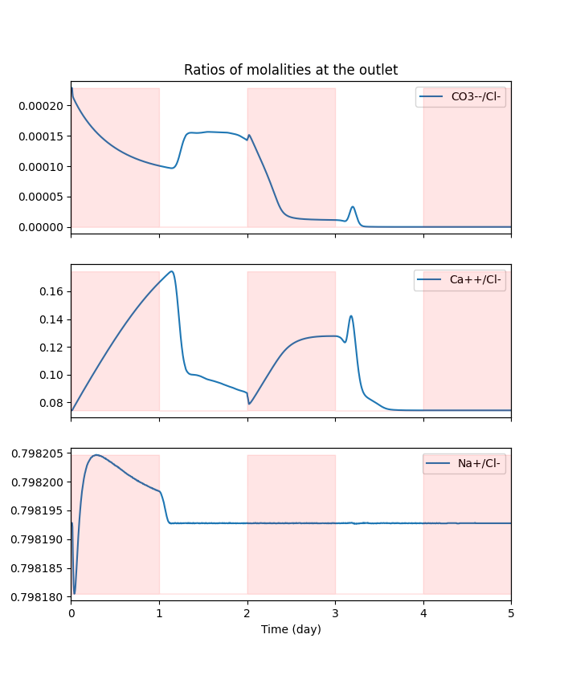
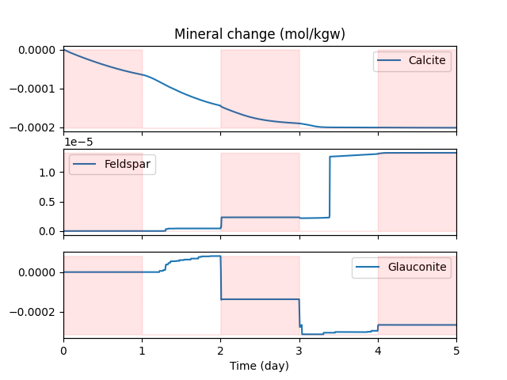
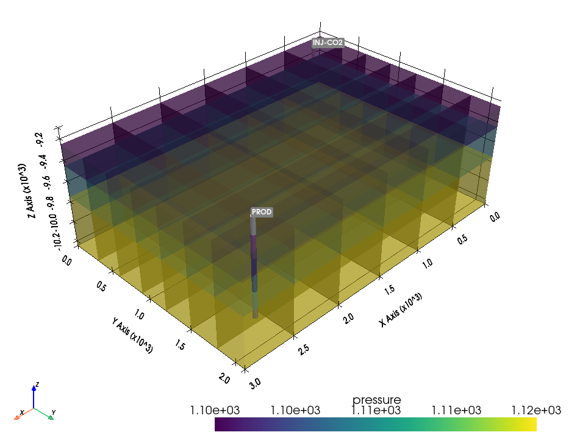

# SR3 Reader
## Python routines for reading of Computer Modelling Group Ltd. (CMG) binary output files

&nbsp; 

SR3 Reader is a set of free Python utilities to read and visualize the output of Computer Modelling Group Ltd. (CMG) simulation software. The implemented functionality allows for great flexibility in creating automated workflows for data analysis, sensitivity studies, and history matching.

## Installation

Simply copy the file  `sr3_reader.py` where Python can find it. 

## Examples

### Visualization of CMG GEM simulation results of a 1D coreflooding experiment

The file  `coreflood_geochem.sr3` contains CMG GEM results for simulation of a coreflooding experiment, where the supercritical CO2 and a reservoir brine are injected in a core sample in an alternating manner. The resulting  geochemical reactions yield variable ions composition at the sample outlet, a change in mineral composition of the sample, and the associated changes in porosity and permeability.

The script  `plot_coreflood_geochem.py` reads the simulation data and plots a number of graphs using `matplotlib`.   

(The pink stripes in the images above denote the CO2 injection periods.)

## Visualization of CMG GEM results on a 3D Cartesian grid  

The file  `cartesian_grid_example.sr3` contains CMG GEM results for simulation of a CO2 flooding in a Cartesian reservir with wells (inspired by a template from a CMG GEM distribution). The script `plot_cartesian_grid.py` reads the simulation data and plots a snapshot of pressure at the start of the simulation using  `pyvista`.

## Disclaimer

Since the internal format for binary SR3 files is not officially documented by CMG, it is sometimes not obvious what this or that data field mean. Although the code has been thoroughly tested on selected datasets, NO WARRANTY OF ANY KIND IS  PROVIDED WITH THE SOFTWARE (see the full copyright notice in `sr3_reader.py`).

## Contributing

Anyone who wishes to contribute to this project, whether documentation, features, bug fixes, code cleanup, testing, or code reviews, is very much encouraged to do so.
